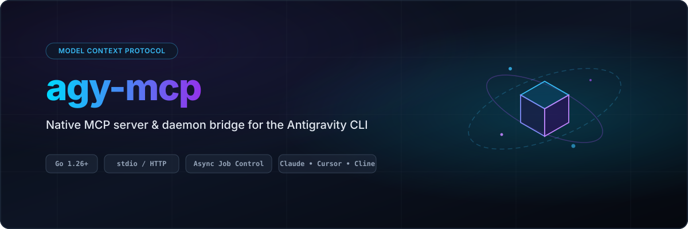

<p align="center">
  
</p>

<p align="center">
  <a href="https://github.com/tphakala/agy-mcp/actions/workflows/ci.yml"></a>
  <a href="https://github.com/tphakala/agy-mcp/actions/workflows/codeql.yml"></a>
  <a href="https://github.com/tphakala/agy-mcp/tags"></a>
  <a href="https://pkg.go.dev/github.com/tphakala/agy-mcp/v2"></a>
  <a href="https://codecov.io/gh/tphakala/agy-mcp"></a>
  <a href="LICENSE"></a>
  <a href="https://modelcontextprotocol.io"></a>
</p>

An MCP (Model Context Protocol) server that wraps the [Antigravity CLI](https://antigravity.google) (`agy`), so any MCP client (Claude Code, Cursor, Cline, and others) can run `agy` prompts, peer reviews, and follow-up turns as native tools.

> Status: feature complete (stdio and HTTP transports, async and sync job lifecycle, model and session discovery, per-run controls and structured output, cross-platform builds) and verified against a live agy, with 1.1.15 the minimum supported version.

## Why

Driving `agy` from a shell for automation has two recurring problems:

- `agy -p` (print mode) reads stdin even when the prompt is passed with `-p`. If stdin is an open pipe that never closes, it blocks indefinitely. The fix is to always close stdin (`</dev/null`), which is easy to forget.
- A review can run for many minutes. A single blocking call ties up the caller and can exceed a client's tool-call timeout with nothing recoverable.

`agy-mcp` solves both by running `agy` as managed, asynchronous jobs behind a small, typed tool surface, and by capturing output to disk, with a completed run's result and metadata `fsync`'d, so the result survives a client disconnect, a server restart, or a crash.

Every job runs `agy --output-format stream-json`, and the supervisor decodes that event stream as it arrives. That is where the conversation id, the response text, the failure message, and the token accounting all come from, so agy-mcp never has to infer any of them.

## What it provides

- `agy_run` / `agy_status` / `agy_cancel`: start an `agy` prompt, poll for completion, cancel if needed.
- `agy_run_sync`: start a prompt and wait for it inline (bounded, with MCP progress notifications); returns the `job_id` to wait on or poll if it outlives the wait cap.
- `agy_wait`: block until an already-started job finishes (bounded, with MCP progress notifications); one call replaces an `agy_status` poll loop.
- `list_models`: enumerate available `agy` models, as the ids the `model` parameter accepts plus their display labels.
- `list_agents`: enumerate available `agy` agents, as the names the `agent` parameter accepts. Unlike `list_models` there is no id/label split, because `agy` takes an agent name verbatim; an empty list just means no agents are configured.
- `list_sessions`: list known conversations so review threads can be continued.

`agy_run` and `agy_run_sync` also take optional per-run controls, each forwarded to `agy` only when set: pick the `model`, reasoning `effort` (`low`/`medium`/`high`), execution `mode` (including a `plan`-only pass), a named `agent`, `sandbox` terminal restrictions, and a `json_schema` to constrain the result to structured output.

Pass `model` as an **id** (`gemini-3.1-pro-high`), the form `list_models` returns in its `models` field, not as the display label `agy` prints beside it (`Gemini 3.1 Pro (High)`). `agy` takes either form on its own, but every display label in the `agy` 1.1.11 catalog was refused once `effort` was set too, at every effort. The same applies to `AGY_MCP_DEFAULT_MODEL`. Not every id accepts every effort either, and some accept none, so omit `effort` unless you need a specific one.

Session continuation rides `agy`'s own durable conversation store (`--conversation <id>`), so threads survive across calls without keeping a process warm.

**A delegated run can modify your files.** `agy` is launched with
`--dangerously-skip-permissions`, so the agent it starts can read *and write* anywhere under
`cwd` and under every directory passed in `dirs`, without prompting. For a review that must
not touch the repo, say so explicitly in the prompt. The tools declare this on the wire: `agy_run` and
`agy_run_sync` are annotated `destructiveHint: true` / `openWorldHint: true`, `agy_cancel` is
`destructiveHint: true` / `idempotentHint: true`, and `agy_status`, `agy_wait`, `list_models`,
`list_agents` and `list_sessions` are `readOnlyHint: true`. Annotations are hints, so a client is free to
ignore them; one that does gate confirmation on them may stop prompting for the four
read-only tools.

Two transports run the same core:

- **stdio** (default): zero-config, one line in your MCP client config.
- **Streamable HTTP** (opt-in): a long-lived, loopback-only daemon for multi-client use. See [HTTP mode](#http-mode).

## Requirements

- **agy 1.1.15 or newer**, on `PATH` or configured explicitly via `AGY_MCP_AGY_PATH`. This is a hard floor, not a recommendation. The floor is 1.1.15 because that release fixed streamed text corrupting non-ASCII characters into replacement characters in the `--output-format stream-json` text deltas. Those deltas are the text agy-mcp falls back to for a run cut short before agy's result event, or one agy completes with an empty response: on an older agy that text is lossy for non-ASCII content (another language, emoji, box drawing, unicode in code), and agy-mcp cannot repair bytes it never received intact. Earlier, lower floors it subsumes: 1.1.8 added `--output-format` to print mode and agy-mcp drives every job through the `stream-json` format it introduced; 1.1.10 is the first release where the run-shaping flags agy-mcp forwards in headless `-p` (`--model` and `--effort`) are honored rather than silently ignored; 1.1.12 added the machine-readable `models` envelope (`command.data.models`) that `list_models` decodes into ids and labels instead of tab-splitting text, and fixed `--mode` being ignored in headless `-p`; and 1.1.14 made a failed language server exit non-zero instead of reporting success, so agy-mcp records that failure as failed (all per agy's changelog). Older builds are refused rather than degraded.

  The version is checked once per process, the first time a tool actually needs agy, and the verdict is cached. A binary that is too old is reported as `agy 1.1.15 or newer is required ...; found 1.1.7 at /usr/local/bin/agy`. A failed check is deliberately not cached, so upgrading agy is picked up without restarting the server.

  A missing `agy` does not stop the server from starting. `initialize`, `tools/list`, and `list_sessions` never exec it, so the lookup is deferred: the server starts, logs a warning to stderr, serves discovery normally, and the tools that do need the binary (`agy_run`, `agy_run_sync`, `list_models`, `list_agents`) fail per call with `agy not found on PATH; set AGY_MCP_AGY_PATH`. An `agy` installed later is picked up without restarting the server. An explicit `AGY_MCP_AGY_PATH` is treated differently: it is a claim about one specific binary, so a typo or a non-executable target still fails fast at startup.
- Go 1.27+ to build.
- The server builds and runs on Linux, macOS, and Windows. Job supervision (running agy as managed jobs via `agy_run` / `agy_run_sync` / `agy_status` / `agy_cancel`) is implemented on **Linux** and **macOS** (process groups, SIGTERM cancel, an advisory flock) and on **Windows** (Job Objects, `OpenProcess` + process creation time, `LockFileEx`); stdio/HTTP serving, `list_models`, and `list_sessions` work identically everywhere.

  Windows behaves the same as Linux with two documented differences:
  - **Cancel and hard timeout are hard kills.** Linux sends agy `SIGTERM` and waits a 10s grace before `SIGKILL`; Windows has no equivalent signal for a detached process, so `TerminateJobObject` ends the whole process tree immediately with no flush window.
  - **Cancel is delivered via a sentinel file, not a signal.** The manager writes a `cancel` file into the job directory and the supervisor polls for it (a few hundred ms), since Windows cannot signal an arbitrary process. Liveness uses the process creation time (an absolute wall-clock value) to defend against PID recycling, which subsumes the Linux boot-id check across reboots.

> Note: every job spawns a fresh `agy` process, which on startup launches whatever MCP servers are configured in agy's own `mcp_config.json`. Peer-review and automation runs usually do not need those servers, and a slow or hanging one adds latency to every job. agy 1.0.7+ bounds this with a per-server launch `timeout` (set `-1` to disable it). If startup is slow, give the unneeded servers a `timeout` in agy's `mcp_config.json`, or point agy at a trimmed config.
>
> Note (continuation): a follow-up turn runs `agy --conversation <id> -p <prompt>`, and the job result is the `response` field of agy's terminal `result` event. Verified against 1.1.10: a resumed run returns only the new turn and echoes the same conversation id, with `num_turns` incremented.
>
> Note (auth): agy-mcp passes its own process environment through to every spawned `agy`, so agy's normal OAuth credentials are used by default. For headless or daemon deployments (HTTP mode, cron) where no browser is available, set `USE_ADC=1` in the server's environment to have agy authenticate via Google Application Default Credentials instead of the interactive sign-in flow (agy 1.0.11+). No agy-mcp flag or code change is needed; unset it to fall back to the other sign-in methods.

## Install

### Homebrew (macOS / Linux)

```bash
brew install tphakala/tap/agy-mcp
```

This installs the prebuilt release binary (macOS and Linux, amd64 and arm64) from [tphakala/homebrew-tap](https://github.com/tphakala/homebrew-tap); upgrade later with `brew upgrade agy-mcp`. The tap formula is regenerated on every release, so upgrades track new versions as they ship.

### Go install

```bash
go install github.com/tphakala/agy-mcp/v2@latest
```

The module path carries a `/v2` suffix from v2.0.0 on, as Go requires for a major version. `go install github.com/tphakala/agy-mcp@latest` still resolves, but to the last v1 release.

## Use with Claude Code (stdio)

```bash
claude mcp add agy -- agy-mcp
```

Or add to your MCP client config:

```json
{
  "mcpServers": {
    "agy": { "command": "agy-mcp" }
  }
}
```

## Tools

- `agy_run(prompt, model?, effort?, mode?, agent?, sandbox?, dirs?, conversation_id?, continue_latest?, cwd?, timeout?, json_schema?)` -> `{ job_id, conversation_id?, state }`
- `agy_run_sync(prompt, model?, effort?, mode?, agent?, sandbox?, dirs?, conversation_id?, continue_latest?, cwd?, timeout?, json_schema?, wait?)` -> `{ job_id, state, elapsed, result?, error?, failure_reason?, recovery?, conversation_id?, model?, partial?, num_turns?, usage?, step_type?, note? }`
- `agy_status(job_id)` -> `{ state, elapsed, result?, error?, failure_reason?, recovery?, conversation_id?, model?, partial?, num_turns?, usage?, step_type? }`
- `agy_wait(job_id, wait?)` -> `{ job_id, state, elapsed, result?, error?, failure_reason?, recovery?, conversation_id?, model?, partial?, num_turns?, usage?, step_type?, note? }`
- `agy_cancel(job_id)` -> `{ state }`
- `list_models()` -> `{ models, model_details }`
- `list_agents()` -> `{ agents }`
- `list_sessions(dir?)` -> `{ sessions }`

`models` holds ids alone, so its entries can be passed straight to `model`; `model_details` pairs each id with the display label `agy` prints for it, in the same order, for showing a readable name. Through v2.1.0 `models` carried each `agy models` row whole, which was a tab-joined `id<TAB>label` string that `agy` does not accept as a model at all, so a client had to split it and pick a column ([#135](https://github.com/tphakala/agy-mcp/issues/135)).

`usage` is agy's own token accounting (`input_tokens`, `output_tokens`, `thinking_tokens`, `cache_read_tokens`, `total_tokens`), and together with `num_turns` it appears once a run reports a terminal result.

`model` echoes the model id agy-mcp resolved for the run (the one you passed, or `AGY_MCP_DEFAULT_MODEL`, reduced to its id), so a caller can confirm which model actually ran. It is absent when no model was pinned and `agy` ran on its own default.

A run that ends badly still hands back whatever it managed to say, so `result` is set on `failed` and `cancelled` jobs too and is worth reading rather than discarding. `partial` is what says whether to trust it as the final answer, and it follows from where the text came from rather than from the state. When such a run produced no text at all but still named a conversation, `recovery` carries a short note on continuing that conversation instead of restating the task. A `quota_exhausted` failure is the exception: its `recovery` note advises waiting for the reset and retrying even when no conversation was named (see `failure_reason` below).

`failure_reason` classifies a `failed` job into one stable, machine-readable category so a caller can branch on the cause without scraping `error`. It is present only when `state` is `failed` (a cancelled job is already named by its state, and a running or done one has no failure), and the set is closed, so treat any value you do not recognize as `unknown`. The values are `quota_exhausted` (agy hit a provider quota or rate-limit wall), `timeout` (agy-mcp killed the run for exceeding its timeout), `spawn_failed` (the agy binary could not be started, or agy itself exited 127, which shares the same exit sentinel), `agy_error` (agy itself reported an error, exited non-zero, or returned an indeterminate result), `interrupted` (the job process vanished without writing a result), and `unknown` (a failure fitting none of the above, for example its output could not be read). `quota_exhausted` is the one that is transient rather than fatal: `error` keeps agy's message including the reset window (agy-mcp does not parse it out), and `recovery` says to wait for the reset and then retry, reusing `conversation_id` when one was named. So a caller that hits a quota wall can back off until it clears instead of treating the run as a hard failure.

It is true when the text was reconstructed from the streamed events, which happens when agy never reported a terminal result (a clean exit whose final event never arrived, a cancel, a timeout, a supervisor that died mid-stream) and also when agy did report one whose response was empty, so the stream is the only text there is. It is likewise true when agy reported a terminal result that was not a success, in which case the text is only what the run had produced by the time it stopped. A response agy itself marked successful is never `partial`, even on a job that was then cancelled or killed: agy prints its result and can hang on the way out, so the answer was already complete when the job was terminated. Note the distinction that last sentence turns on, since a `done` job can still report `partial`: it is a claim about agy's own response, not about every result reported for a run agy marked successful.

Parameter and result fields carry their own descriptions in the tool schemas, so a client sees
them without consulting this file. The constraints worth knowing up front: `conversation_id`
and `continue_latest` are mutually exclusive (setting `continue_latest` true alongside a
`conversation_id` is an error); `timeout` is a Go duration and a value above 24h is rejected
outright, and on expiry the
`agy` process tree is killed and the job ends in state `failed`; `effort`, when set, must be
`low`, `medium` or `high`, and `mode`, when set, must be `accept-edits` or `plan`, with any other
value rejected before the run starts; `wait` defaults
to 2m and is silently clamped to 10m, and it bounds only the inline wait, never the job itself.
`agy_cancel` is asynchronous, so it usually returns `running` and the job settles to `cancelled`
a moment later. A `prompt` is sent to agy literally: a leading slash-command or skill name
(a prompt beginning with `/`) is treated as text rather than expanded, so caller input means
exactly what it says regardless of the installed agy version.

A fresh `agy_run` (no `conversation_id`, no `continue_latest`) reports the conversation agy
created for it. agy names the conversation in the `init` event of its stream, which arrives
about a second after the process starts, so `agy_run` waits briefly (up to 2s) for it and
returns a real `conversation_id`. If the wait expires the field comes back empty and
`agy_status` supplies it moments later; either way the thread can be continued.
`agy_run_sync` does not pay that wait: it takes its `conversation_id` from the status it
is already polling. That is also what makes its `wait` cap honest, because the
conversation-id wait used to run before the inline wait's deadline was set, so a short
`wait` could be overrun by up to the 2s budget. The trade is that a `wait` shorter than
agy's init latency now returns an empty `conversation_id`, which `agy_status` supplies.

**Fresh runs are not serialized.** Any number of them can run in one directory at the same
time, bounded only by the global concurrency cap. Earlier versions refused a second fresh run
in a directory that already had one, because the conversation id had to be inferred by diffing
agy's shared conversation cache and that inference was only sound while nothing else could
touch the same entry. Reading the id from agy's own stream removes the ambiguity and the
restriction with it.

What is still serialized is a **conversation**: two runs continuing the same `conversation_id`
cannot overlap, because concurrent agy sessions on one conversation trigger a known session-lock
hang in agy itself. The second is refused with a conflict error rather than queued. That gate is
rebuilt at startup from jobs whose supervisor outlived a server restart, so it holds across
restarts.

Conversation serialization also holds across separate `agy-mcp` processes, which matters in
stdio mode, where each MCP client session spawns its own process sharing one
`AGY_MCP_STATE_DIR`. A per-conversation advisory lock (`flock` on a file under
`<state-dir>/locks/`) stops two sibling sessions from continuing the same conversation at once.
The global concurrency cap, by contrast, is enforced per process: with N client sessions each
capped at the configured limit, up to N times that many runs can be in flight. Lock files are
left in place by design (unlinking a `flock` file races), so `locks/` keeps one empty file per
conversation ever locked.

Two caveats, both now scoped to continuations only. `AGY_MCP_STATE_DIR` must live on a local
filesystem that supports `flock` (not NFS, where `flock` may be a no-op or fail); a continuation
is refused rather than started if the lock cannot be taken, so cross-process exclusion can never
silently lapse. And across a server restart there is a brief window, while the manager process is
down, before it re-takes the locks for jobs whose supervisor outlived it; a sibling process that
continues the same conversation during that window is not blocked. The in-process gate is always
restored at startup, so this gap is limited to the restart window itself. Fresh runs take no lock
at all and are unaffected by either caveat.

## Completion wake for Claude Code

Claude Code does not surface MCP server notifications to the model: progress notifications are UI-only, and there is no server-initiated push that can wake the model when an async job finishes. Polling `agy_status` after `agy_run` is the protocol-level baseline. agy-mcp ships a hook bridge that turns job completion into a real wake instead, built on Claude Code's `asyncRewake` hook mechanism: a background PostToolUse hook that exits with code 2 wakes the model with the hook's stderr as a system reminder.

Add to your Claude Code `settings.json`:

```json
{
  "hooks": {
    "PostToolUse": [
      {
        "matcher": "mcp__agy__agy_run(_sync)?",
        "hooks": [
          { "type": "command", "command": "agy-mcp hook-wait", "asyncRewake": true, "timeout": 3700 }
        ]
      }
    ]
  }
}
```

How it behaves:

- After every `agy_run`, the hook waits (in the background, off the session's critical path) for the job's completion sentinel and then wakes Claude with a one-line message naming the `job_id` and final state, prompting the model to call `agy_status` when the result is actually ready.
- `agy_run_sync` calls that returned their result inline produce no wake; a sync call that overran its wait cap (and so returned a still-running job) gets the same completion wake as `agy_run`.
- On timeout (default 1h, `-timeout` to change) the hook still wakes Claude, reporting the job as still running, so a long job is never silently lost, provided the outer hook `timeout` exceeds hook-wait's own `-timeout` (see the `settings.json` note below). An externally interrupted wait (a SIGINT or SIGTERM delivered to hook-wait) also wakes, with a distinct "wait interrupted" message pointing at `agy_wait` and `agy_status`, rather than exiting silently and dropping the owed wake. On any internal error the hook exits 0 silently; it can never disrupt the tool call it observes. The hook-level `timeout` in `settings.json` (3700 above) must exceed hook-wait's own `-timeout` (1h by default), so hook-wait's internal timeout always fires first and reports the wake itself; if the outer `timeout` is equal or lower, Claude Code kills the hook process first and the exit-2 wake is lost, silently defeating that guarantee.
- The `agy` in the matcher pattern `mcp__agy__agy_run(_sync)?` is the server name you passed to `claude mcp add agy`; if you registered the server under a different name, change both the `claude mcp add` name and that `agy` segment of the matcher.
- Claude Code runs hooks with the user's shell environment, not the MCP server entry's own env block, so if the server is registered with a custom `AGY_MCP_STATE_DIR` the same value must also be exported in the shell (or passed inline in the hook command) or hook-wait will silently look in the wrong state directory and never wake.

Two related subcommands, useful beyond Claude Code:

- `agy-mcp wait-job [-timeout 1h] <job_id>` blocks until the job is terminal and prints the final state word (`done`, `failed`, or `cancelled`) to stdout. Exit codes: 0 terminal, 1 error, 2 usage, 3 timeout, 130 interrupted. It needs only the job state directory, not the agy binary, so it works in minimal environments.
- `agy-mcp hook-wait [-timeout 1h]` is the hook entrypoint described above: it reads the PostToolUse payload from stdin, so it is not useful to invoke by hand, but it is a single self-contained binary call, no shell wrapper or jq required, and it works on Linux, macOS, and Windows. The file-based wake contract is exercised by tests on all three platforms; the signal-interrupt wake (SIGINT/SIGTERM) is a POSIX behavior and is tested there.

## Preflight (`agy-mcp doctor`)

`agy-mcp doctor` runs the read-only checks a run depends on and prints a one-line verdict for each, so a broken setup names its own cause instead of surfacing as a downstream tool error (for example `list_models` failing when `agy` is missing from PATH or not authenticated). It checks that the `agy` binary resolves, meets the version floor, and is reachable and authenticated (a model listing); that the state directory is writable; names where each effective setting came from (an environment variable or the default) without printing any secret value; and reports any stale jobs a prior crash left behind. It never starts a job or mutates job state.

The exit code is meant for a setup script or CI: `0` when nothing is broken (a stale-job warning does not count, and a fresh install with no jobs passes), `1` when a check failed, `2` on a usage error. A `WARN` line (leftover jobs the periodic GC will reap) is information, not a failure.

On POSIX, both wait subcommands install their SIGINT/SIGTERM handler only after parsing flags, resolving the job state directory and building the wait manager (and hook-wait also reads its payload from stdin first), so a signal sent immediately after launch can land before the handler exists and kill the process outright, losing the interrupt exit code. A parent that intends to interrupt a wait can close that window by setting `AGY_MCP_WAIT_READY_FILE`: the subcommand creates that file the moment the handler is in place, so waiting for it to appear makes the signal deliverable. Leave it unset and nothing is written. Three caveats, because existence is the entire signal: the path must be absolute (a relative one resolves against each process's own working directory, and hook-wait runs from the session cwd), it must be fresh and unique per invocation (a file left from an earlier run satisfies the wait immediately and hands back the race), and the parent still needs its own timeout, since both subcommands have exit paths that return before any handler is armed. An existing file at that path is refused rather than overwritten, so pointing the variable at something that matters destroys nothing; that protects the file, not the handshake, which is why the path has to be fresh.

MCP clients other than Claude Code get the same no-polling benefit in-protocol: call `agy_wait` with a `job_id` from `agy_run` (or from an `agy_run_sync` that outlived its inline wait) and the tool blocks (bounded by `wait`, default 2m, max 10m) until the job finishes.

## HTTP mode

```bash
agy-mcp -http 127.0.0.1:8765
```

HTTP mode is opt-in and only accepts a loopback bind address (`localhost`, `127.0.0.1`, or `::1`). A non-loopback address (including `:8765`, which binds all interfaces) is refused at startup, so it cannot be accidentally exposed.

Two extra hardening layers are always available:

- **Origin/CSRF protection** is always on. A state-changing cross-origin browser request (one carrying a cross-site `Sec-Fetch-Site` or a mismatched `Origin`) is rejected with `403`. Normal non-browser MCP clients (Claude Code, Cursor, the go-sdk client) send no `Origin` header and are unaffected.
- **Optional bearer token.** Set `-http-token <token>` (or `AGY_MCP_HTTP_TOKEN`) to require `Authorization: Bearer <token>` on every request; a missing or wrong token gets `401`. The flag overrides the env var. Off by default, so the bare loopback mode stays unauthenticated.

```bash
agy-mcp -http 127.0.0.1:8765 -http-token "$(openssl rand -hex 32)"
```

## Upgrading from v2.1

**Behaviour change to check your client against:** `list_models` used to return each `agy models` row whole in `models`, as a tab-joined `id<TAB>label` string. It now returns the id alone, and pairs each id with its display label in the new `model_details` field. No type on the wire changed, only the values, so a client that renders `models` to a human now shows a slug and should read `model_details[].label` instead, and one that split each entry on the tab will find nothing to split. A stored old value passed back as `model` still works: the server reduces a whole row to its id before running it.

## Upgrading from v1

v2 requires agy 1.1.15 and drives it through `--output-format stream-json`. The upgrade is safe to do in place, but two things are worth knowing.

**Stop the server before replacing the binary.** The supervisor is the same `agy-mcp` binary re-executed as `agy-mcp run-job <dir>`, so replacing it under a live v1 server pairs an old manager with a new supervisor. The supervisor detects that case and asks agy for the event stream anyway, so no result is lost, but a v1 manager and a v2 process sharing one `AGY_MCP_STATE_DIR` briefly disagree about cross-process locking, and a v1 run's conversation id can be misattributed in that window.

**Jobs already in the state directory keep working.** A job dir written by v1 loads cleanly (the two removed `meta.json` fields are simply ignored) and its result is still reported in full. Two degradations apply until those jobs age out of the 24h TTL:

- A v1 fresh run may report no `conversation_id`. v1 recovered it by diffing agy's conversation cache, and v2 has no such path. Recover the thread with `list_sessions` if you need it.
- Cancelled and interrupted v1 jobs behave as before; only the id is affected.

**Behaviour changes to check your client against:** `agy_run` now blocks up to 2s waiting for agy to name the conversation, instead of returning instantly; fresh runs in the same directory no longer conflict, so anything that relied on that conflict error as a mutex now gets real concurrency (and agy runs with `--dangerously-skip-permissions`, so concurrent runs edit one working tree); and `list_models` is now refused on an agy older than 1.1.15, even though `agy models` itself would work there.

## Configuration

| Env | Default | Meaning |
|-----|---------|---------|
| `AGY_MCP_AGY_PATH` | `agy` on PATH | path to the agy binary |
| `AGY_MCP_STATE_DIR` | `$XDG_STATE_HOME/agy-mcp` | job state directory |
| `AGY_MCP_DEFAULT_MODEL` | agy default | default model, as an id (`gemini-3.1-pro-high`), not a display label |
| `AGY_MCP_HTTP_TOKEN` | (none) | optional bearer token for HTTP mode; empty = unauthenticated |
| `AGY_MCP_WAIT_READY_FILE` | (none) | absolute path `wait-job` / `hook-wait` create once their SIGINT/SIGTERM handler is installed, so a parent can signal without racing it; must be fresh per invocation, an existing file is refused rather than overwritten; empty = nothing is written |

## Development

```bash
go build ./...
go test ./... -race
golangci-lint run
```

CI builds and vets on Linux, macOS, and Windows; runs the race-enabled test suite on Linux and macOS; and runs the test suite (without the race detector) on Windows.

## License

MIT. See [LICENSE](LICENSE).
